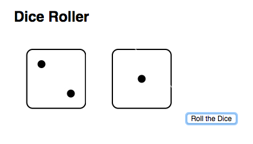

#  Functions and Scope (3:00)

| Timing | Type | Topic |
| --- | --- | --- |
| 10 min | [Opening](#opening) | Introduction to Functions  |
| 20 min | [Codealong](#codealong1) | Function Declaration |
| 30 min | [Lab](#lab1) | Rolling Dice |
| 15 min | [Codealong](#codealong2) | Parameters |
| 15 min | [Codealong](#codealong3) |  The Return Statement |
| 10 min | [Introduction](#introduction1) | Introduction to Scope |
| 15 min | [Codealong](#codealong4) | Local and Global Scope Usage |
| 60 min | [Lab](#lab3) | Hubot: Independent Practice |
| 5 min | [Conclusion](#conclusion) | Final Questions & Exit Tickets |
| 45 min | [Bonus Labs](#lab2) | Currency Converters |


### Objectives

*After this lesson, students will be able to:*

- Describe how parameters and arguments relate to functions.
- Create and call a function that accepts parameters to solve a problem.
- Define and call functions defined in terms of other functions.
- Return a value from a function using the return keyword.
- Define and call functions with argument dependent return values.
- Know the scope of your local and global variables.
- Create a program that hoists variables.

### Preparation
*Before this lesson, students should already be able to:*

- use conditionals to control program flow.
- Differentiate between true, false, 'truth-y', and 'false-y'.
- Use boolean logic (!, &&, ||) to combine and manipulate conditionals.

---
<a name="opening"></a>
## Introduction to Functions (10 min)

A function is a reusable statement, or a group of reusable statements, that can be called anywhere in the program so that the statements inside the function do not need to be written over and over again. Functions enable the software developer to segment large, unwieldy applications into smaller, more manageable pieces.

Functions are a critical component of programming because it allows us to execute on a key tenant of engineering, Don't Repeat Yourself, commonly referred to as DRY. Our goal is to craft our programs in as few lines of code as possible, while still being clear.

Another interesting thing about functions is that they are just like objects or strings. You can pass a function into other functions as an argument, and can also use it just like any other object we've been working with.

---
<a name="codealong1"></a>
## Function Declaration (20 min)

Before we call, or "use", a function, we must define it. In JavaScript, functions can be defined in several ways. Two more common methods are __function declarations__ and __function expressions__.

__Function Declarations:__
```javascript
function speak (words) {
  console.log(words);
}
```

__Function Expressions:__
```javascript
var speak = function (words) {
  console.log(words);
}
```

While both methods are similar, an important difference between function declarations and function expressions involves the concept of __hoisting__. In JavaScript, function declarations are always moved, or "hoisted", to the top of their scope by the interpreter. In other words, you can call a function declaration before defining it:

```javascript
speak('hello, world!')

function speak(words) {
  console.log(words)
}

// DOES NOT RESULT IN ERROR
```

Function expressions, however, must be defined before they are called:

```javascript
speak('hello, world!')

var speak = function (words) {
  console.log(words)
}

// RESULTS IN ERROR:
// TypeError: undefined is not a function
```

#### Function Declaration Syntax

A function declaration always has the following:

* A name
* An optional list of parameters - the names of arguments to be "passed" into the function, or information the function will use - defined by the parenthesis before the opening curly brace
* Statements inside the function - this is the code executed every the function is called

In our example above, the function name is `speak`. The parameter is `words`. If we had multiple parameters it would be a comma separated list inside the parentheses `(words, num)` and the statement is `console.log(words);`

And this makes up a basic function declaration!

#### Calling Functions

Calling, or invoking, a function will execute the code defined inside this function.

Defining and calling a function is different - a function will not be called when it's defined.

You call a function by using parenthesis after the function's name `()`:

```javascript
function hello () {
  console.log("hello there!")
}

hello();

=> hello there!
```

Often, JavaScript functions will be defined as methods on objects. To call a function as a method:

```javascript
var person = {
  name: 'Obama',
  speak: function () {
    console.log('Hello, World!')
  }
}

person.speak()
=> 'Hello, World!'
```
---
<a name="lab1"></a>
## Rolling Dice: Lab (30 min)

For this lab, you'll be creating a page where every time the user hits the "Roll Dice" button, the screen randomly updates the two dice. Open the [app.js file](starter-code/dice/js/app.js). Use the html and css code included in the starter code folder to get started.



Before writing any code, make sure to write down the pseudocode for the exercise!

>Note: We haven't covered DOM Manipulation yet, but students will need to get some familiarity with [document.getElementById](https://developer.mozilla.org/en-US/docs/Web/API/Document/getElementById) to complete this exercise. Make sure to either hint at this or give them a short intro.

<a name="codealong2"></a>
## Parameters (15 min)

If we had a function that did the same thing every time it was called, it wouldn't make for the most powerful codebase. Furthermore, if we wanted to enable additional behaviors in our application, we would have to write a new function for each new feature:

```javascript
// Bad idea...
function helloMark () {
  console.log('hello, Mark');
}

function helloObama () {
  console.log('hello, Obama')
}
```

> __Instructor's Note:__ Ask students as to why writing such specific functions is a bad idea. If there are no immediate answers, ask what happens to the above program structure if there are 1,000 users. If we have to write 1,000 different functions, is this a scalable and maintainable program?

Parameters remedy this problem by allowing us to call, or invoke, the same function with different values:

```javascript
function sayHello (name) {
  console.log('Hello ' + name);
}

sayHello('Mark');
=> 'Hello Mark'

sayHello('Obama');
=> 'Hello Obama'
```

In this example, the function `sayHello` is declared with one parameter, `name`. To write functions with **more than one parameter**, use a comma separated list: `(param1, param2, param3, param4)`. In JavaScript, functions can accept up to 255 parameters!

```javascript
function sum(x, y, z) {
  console.log(x + y + z)
}

sum(1, 2, 3);
=> 6
```

JavaScript is a loosely, or weakly (as opposed to "strongly") typed language. This means that when writing functions, one do not need to specify the data-type (string, number, etc.) of the function's parameters. While this reduces the overall amount of code the programmer must write, it makes JavaScript particularly prone to type errors: when a value is not of the expected data type. This is because in JavaScript, function definitions do not perform any type checking on arguments that are passed into the functions.

>Note: Parameters vs Arguments. The terms __parameters__ and __arguments__, though often used interchangeably, do have different meanings.

__Parameters__ refer to variables defined in the function's declaration, whereas __arguments__ refer are the actual values passed into the function when the function is called. For example:

```javascript
// Parameter
function doSomething (parameter) {
  // does something
}

// Argument
doSomething(argument)
```
---
<a name="codealong3"></a>

## The Return Statement (15 min)

Sometimes we don't want to print to the console or update the DOM, but instead want to update a variable or even call another function. To do this we use a `return` statement. When we return something, it ends the function's execution and "spits out" whatever we are returning. We can then store this returned value in another variable...

```javascript
function sum (x, y) {
  return x + y;
}

var z = sum(3, 4);
=> 7
```
... or pass it to another function:

```javascript
function sum (x, y) {
  return x + y
}

function double (z) {
  return z * 2
}

var num = sum(3, 4)
=> 7
var numDbl = double(num)
=> 14

// This can also be written:
var num = double(sum(3,4))
=> 14
```

Note that the `return` statement will stop, completely, a function's execution. Any statements following the `return` statement will not be called:

```javascript
function speak (words) {
  return words;

  // The following statements will not run:
  var x = 1;
  var y = 2;
  console.log(x + y)
}
```

By default, JavaScript functions will return an `undefined` value. To test this, define and run a function __without__ a return value using Node. When writing a function using a `return` value, you are "overwriting" this default value.

---
<a name="introduction1"></a>

## Introduction to Scope (15 min)

Scope is the set of variables that you have access to. As we learned early on JavaScript reads from top to bottom. But sometimes we declare variables inside functions (just like arguments) and these variables aren't accessible in other parts of our code. This is the concept of scope.


#### Global Scope

Before you write a line of JavaScript, you're in what we call the `Global Scope`. When a variable is declared outside a function, it is public and referred to as a GLOBAL variable. This means it also is considered having a global scope. Any script or function on the page can then reference this variable.

For example, when you declare a variable off the bat, it's defined globally:

```javascript
var name = 'Gerry';
```

Global scope can be really confusing when you run into namespace clashes. You won't want to use global scoping for all your variables, as using global scope the right way is quite complex, but every Javascript program uses the global scope in one way or another.

> Note: If time permits, instructors may want to briefly go over what [namespace](http://www.codeproject.com/Articles/829254/JavaScript-Namespace) means in JavaScript.

#### Local scope

Conversely, if a variable is declared inside a variable, it is local to the function and referred to as a LOCAL variable. It also means it has local scope.

When we have a variable with local scope, it cannot be referenced outside of that function.

---

<a name="codealong4"></a>

## Local and Global Scope Usage (15 mins)

Take a look at the below:

```javascript
var a = "this is the global scope";
function myFunction() {
  var b = "this variable is defined in the local scope";
}
myFunction();
console.log(b);
```

The console log in this case will throw a reference error because the variable `b` is not accessible outside of the scope if the function where it is defined.

In the logic defined above, the fact that a variable cannot be accessed by the parent scope works only in one way.

A function can access variables of the parent scope. In other words, a function defined in the global scope can access all variables defined in the global scope.

```javascript
// Global Scope
var a = "Hello";

// This function is defined in the global scope
function sayHello(name) {
    return a + " " + name;
}

sayHello("JavaScript");
=> "Hello JavaScript";
```

### Nested Function Scope

When a function is defined inside another function, it is possible to access variables defined in the parent from the child:

```javascript
var a = 1;

function getScore () {
  var b = 2,
  c = 3;

  function add() {
  return a + b + c;
  }

  return add();
}

getScore();
=> 6
```
---
<a name="lab3"></a>
## Hubot: Independent Practice (60 mins)

>Note: The following lab is very challenging and will likely require a good deal of troubleshooting. Provide the students with the below set of instructions and have them work in groups of 2-3, with each group having its own Hubot and Slack API token. Before class, you'll want to configure multiple Hubot integrations for the class (the maximum number of Hubots per Slack organization is 10); [Click here](https://my.slack.com/services/new/hubot) to configure a new Hubot.  Once each Hubot has been configured, edit its configuration in order to access its API token. **It's important to configure enough Hubots and API tokens prior to class, as Slack starts refusing connections when more than around 5 users attempt to use the same API token simultaneously.** Before starting the lab, the instructor should provide a brief introduction, defining the terms below and outlining the goals of the lab. Students should then follow the instructions to install all the necessary utilities and work through each of the examples, trying to get each to run in the class Slack room. The instructional team should walk around the room and help troubleshoot and offer pointers. **This can be a logistically complex lab, so be sure to give this all a try yourself prior to class.**  

For our unit 1 project, we'll be building our own Slackbot. To get you familiar with bots, we're going to test out something called Hubot in the command line. The Hubot is a "ChatOps" framework that can follow any script written in JavaScript to perform various tasks, from configuring new servers to updating code on Github.

### What Are We About to do?

First off, let's define some terms we'll be using over the course of this lab.

**Slackbot:** You've probably seen automated "bots" on other platforms like Twitter--a bot is essentially a script that is programmed to interact with users as if it's a person. In this lab, we'll begin creating our own bots for use in the class Slack room!

**Hubot:** [Hubot](https://hubot.github.com/) is a framework built by GitHub to help speed up the process of developing SlackBots. It's built using Node.js and something called CoffeeScript and includes a bunch of built-in functionality for performing common bot tasks (posting images, etc.). We'll be leveraging Hubot to help turbocharge the Slackbots we build.

**CoffeeScript:** CoffeeScript is a variant of JavaScript that was designed to make JavaScript more readable and faster to type. CoffeeScript is designed for humans, not computers--at the end of the day, it gets translated into regular JavaScript so that your machine can run it. CoffeeScript is often used in conjunction with Hubot; you won't need to know how to write CoffeeScript for the purposes of this class but know that you will likely encounter it when looking at Hubot examples and documentation. If you encounter a CoffeeScript file (say, the "example.coffee" file that's included with Hubot) and want to better understand what it's doing, you can use a CoffeeScript convertor like [JS2Coffee](http://js2.coffee/) to translate it into vanilla JavaScript.

**Heroku**: Heroku is a platform for hosting and running apps in the cloud. We'll be using Heroku to host the code for our Slackbot, so that it can run independently of our machines.

**Yeoman:** Yeoman is a set of tools that provide a scaffolding for getting web apps up and running quickly. We'll mostly be using a Yeoman tool called yo, which takes care of things like dependencies, build tasks and configuration for you.


### Installing and Configuring Everything

There's a lot that we'll need to install in order to get our bots up and running, so make sure you follow these steps carefully and in order. Your instructor should provide you with a Slackbot and token--make sure you've got those ready, as you'll need both in order to complete many of these steps.

First, you'll need to [sign up for a free Heroku account](http://heroku.com).

Next, [download the Heroku toolbelt](https://toolbelt.heroku.com/). This is a set of tools that will allow us to talk to Heroku's servers using the command line.

Speaking of which, it's now time to fire up the command line. In a terminal window, type the following commands, in order:

**Create your slackbot directory:**

`$ mkdir myslackbot`

**Move into that new directory:**

`$ cd myslackbot`

**Install Hubot and all of its dependencies (CoffeeScript, Yeoman, and the Hubot generator):**

`$ npm install -g hubot coffee-script yo generator-hubot`

**Using Yeoman, generate a Hubot bot:**

`$ yo hubot`

**This will prompt you to answer a few questions about your bot:**

 * Owner: `hit enter`
 * Bot Name: `Give the bot a name`
 * Description: `Optional Description`
 * Bot Adapter: `slack` _Make sure you don't skip this step!_

**Install hubot-slack dependency and save it to your package JSON:**

`npm install hubot-slack --save`

Now, we'll need to push up our bot to Heroku.

**Initialize your local repository:**

`$ git init`

**Add all of your new files:**

`$ git add .`

**Commit your new files:**

`$ git commit -m "Initial Commit"`

**Create a new app on Heroku:**

`$ heroku login`

`$ heroku create myslackbotapp`

 **Connect your local repo to heroku**

 `$ git remote add heroku https://git.heroku.com/myslackbotapp`

**Add the following configs for Slack:**

`$ heroku config:add HEROKU_URL=https://myslackbotapp.herokuapp.com`

`$ heroku config:add HUBOT_SLACK_TOKEN=YourTokenGoesHere`

**Push all your code up to Heroku**

`$ git push heroku master`

**Turn on your bot**

`$ heroku ps:scale web:1`

**Test your bot locally to make sure it's working:**

`HUBOT_SLACK_TOKEN=TOKEN-GOES-HERE ./bin/hubot --adapter slack`

Cool! Now we have our very own Slackbot that's willing and able to do our bidding. But what can it do? Next, we'll take our Slackbot for a test drive.

### Interacting with Your Hubot

To create instructions for your Slackbot, you will add a JavaScript file inside of the `scripts` folder. You can add multiple scripts files to that folder and all will execute when the Slackbot is run. Let's look at a few commands that we might want to use to build our Slackbot scripts.

#### Listening

**.hear**

 The `.hear` command listens for a specific phrase anywhere in the Slack room. You don't have to mention your Slackbot in order to get a response.

 In the below example, anytime the bot hears "Hello!", it will say, "Hi there!":

 ```js
 bot.hear(/Hello!/, function(res) {
   return res.send("Hi there!");
 });
 ```

 ```
 tim: Hello!
 hubot: Hi there!
 ```

**.respond**

 `.respond` is very similar to `.hear`, expect it will only be triggered when someone specifically mentions the Slackbot using `@`, or sends a direct message.

 ```javascript
 bot.respond(/What's your favorite food?/, function(res) {
   return res.send("I'm a robot--I don't eat food!");
 });
 ```

 ```
 tim: @hubot What's your favorite food?
 hubot: I'm a robot--I don't eat food!
 jon: What's your favorite food?
 ... [no response because Jon didn't tag Hubot in his message]
 ```

#### Speaking Responding to User Input

**.send and .reply**

The "send" method allows your Slackbot to send a message to the channel, while the "reply" method allows it to respond directly to a user with an @ reply. In order to understand the difference, we'll need to accept some user input, so let's take a look at the example below.

**The wildcard selector**

 Would you like to accept user input in your script? Take a look at the example below:

 ```js
 bot.respond(/Hi Hubot! My name is (.*)/i, function(msg) {
   var name;
   name = msg.match[0];
   if (name == "Hubot") ){
     return msg.send("You're not Hubot--I'm Hubot!");
   } else {
     return msg.reply("Nice to meet you, " + name + "!");
   }

 });
 ```
 ```
 tim: @hubot Hi Hubot! My name is Tim
 hubot: @tim Nice to meet you, Tim!  
 tim: @hubot Hi Hubot! My name is Hubot
 hubot: You're not Hubot--I'm Hubot!
 ```

Did you notice the difference between `.send` and `.reply`?

Now, let's dig into how the user input part works. As you can see, we're using `.respond` to set the bot up to listen for its @ handle. Here, it's listening for the phrase `@hubot Hi Hubot! My name is _____`. The `(.*)` syntax is a wildcard value that effectively represents the "blank" in that sentence. When the bot is triggered with the phrase, `@hubot Hi Hubot! My name is (.*)`, it stores the contents of `(.*)` in an array called `match` that lives inside of an object called `msg`. When we want to retrieve that value, we use `fav = msg.match[0]` to grab the first value in that array, which in this case, is "Tim".

 <details>
 <summary>
 **Wait, what does the `[0]` mean?** (click the arrow for the answer)
 </summary>
 `msg.match[0]` will grab the value corresponding to the first `(.*)` in the expression. If you use multiple `(.*)`s within one RegEx statement, you can assign each of the values to different variables like so: `var foo = msg.match[1]`, `var bar = msg.match[2]`.
 </details>

 Here's an example that uses two wildcards:

 ```js
 bot.respond(/add (.*) and (.*)/i, function(msg) {
   var a;
   var b;
   a = parseInt(msg.match[0]);
   b = parseInt(msg.match[1]);
   c = a + b

   return msg.reply(a + " plus " + b + " = " + c);
 });

 ```
 ```
 tim: @hubot add 3 and 4
 hubot: 3 plus 4 = 7
 ```

 Here's another example that uses a switch statement to handle different cases:
 ```js
 bot.respond(/what is your favorite (.*)/, function(msg) {
   var fav;
   fav = msg.match[0];
   console.log(fav);
   switch (fav) {
     case "food":
       return msg.reply("I'm a robot--I don't eat food!");
       break;
     case "band":
       return msg.reply("It's gotta be Daft Punk!");
       break;
     case "programming language":
       return msg.reply("Javascript, of course!");
       break;
     default:
       return msg.reply("I don't have a favorite " + fav + ". What's yours?");
   }
 });
 ```
 ```
 tim: @hubot what is your favorite food?
 hubot: @tim I'm a robot--I don't eat food!
 tim @hubot what is your favorite color?
 hubot: @tim I don't have a favorite color. What's yours?
 ```

#### Getting Fancy

 **Regular Expressions**
  You've probably noticed that we haven't used quotes around the phrases that Hubot is listening for, instead using `/` (e.g. `/What's your favorite food/`). What's that about?

  Most programming languages allow you to search for text within text using something called **Regular Expressions**. Regular expressions, or "RegEx," allow you to listen for very specific patterns of text within a document, or in this case, a chat room.

  For example, if you wanted to find the word "what" using a RegEx, you could use the following code: `\bwhat\b`. Here, "b" represents the boundaries of the word (i.e., it's beginning and end) and the "what" represents the word we are searching for.

  Now, that's an advanced example. **For most of your bots, you can probably just enclose phrases between `/` marks**. If you would like to learn more about RegEx, check out the resources below:
  - [RegexOne](http://regexone.com/) walks you through basic to advanced RegEx syntax. Check it out!
  - [RegExr](http://regexr.com/) lets you test out your RegEx without having to constantly start and stop your bot.


To wrap things up, here's one final example of an advanced Slackbot that uses a RegEx and which can respond to a number of different inputs:

```js
module.exports = function(robot) {
    robot.respond(/is it a (weekend|holiday)\s?\?/i, function(msg){
        var today = new Date();

        msg.reply(today.getDay() === 0 || today.getDay() === 6 ? "YES" : "NO");
    });

    robot.hear(/i did it/i, function(msg){
        msg.send("Congratulations! Good job!");
    });

    robot.respond(/are you there?/i, function(msg){
        msg.reply('Yes, usually here, and listening.');
    });

    robot.respond(/convert \$(.*) to btc/i, function(res){
        var usd = res.match[1];
        res.reply('That is about ' + usd * 0.0024 + ' in BTC');
    });

}
```

Hopefully this gives you a sense of some different things that a Slackbot can do and maybe even gives you some ideas for a Slackbot you might want to build...

>Note: Additional information on building and running Slackbots is available in the [Unit 1 Project Prompt](../../projects/unit1/project-01.md)

---

<a name="conclusion"></a>

## Conclusion (5 min)

Make sure the lesson objectives have been met.

* Summarize the difference between global and local scope.
* Explain how you define and call functions using arguments.
* How does Hubot work?

### Before Next Class
|   |   |
|---|---|
| **UPCOMING PROJECTS**  | [Project 1: Slackbot](../../Projects/unit1/project-01.md) |

---
<a name="lab2"></a>

# Bonus Content

The following exercises are purely optional and provided as a bonus for instructors. If your class moves quickly or if advanced students are looking for an additional challenge, you may choose to use the below exercises.

## Bitcoin: Currency Converter

We have given you some starter code where we grab the latest bitcoin trading price. Open the [starter code](starter-code/currency-converter). Based on the US Dollar amount that a user inputs, we should print out the corresponding value in bitcoin based on the last trading price.

>Note: We haven't covered DOM Manipulation yet, but students will need to get some familiarity with [document.getElementById()](https://developer.mozilla.org/en-US/docs/Web/API/Document/getElementById) or [parseFloat()](https://developer.mozilla.org/en-US/docs/Web/JavaScript/Reference/Global_Objects/parseFloat)to complete this exercise. Make sure to either hint at this or give them a short intro.

Before writing any code, make sure to write down the pseudocode for the exercise.

**Sample Starter Pseudocode**

```javascript

* when convert button is clicked, run convert

* function convert
	store the inputted value into a variable
	parse the inputted value
	call `usdtoBTC` function and pass the user inputted value
	display converted amount

 * function usdToBTC
	 var convertedBTC = usd/BTCrate
	 return convertedBTC

  ```

##  Slackbot Part 2: Bitcoin Convertor Bot

  Build a Slackbot that can convert a requested amount in $USD to its equivalent value in Bitcoin. You may use a constant, fixed price instead of the live rate of BTC price.

  When the Slackbot participant enters "convert $X to btc", the bot should return the value in bitcoin.

  **Sample Slackbot**

  
